  

  

  
  
  

  
  
  
  

---

## 👨‍💻 About Me

- 🎮 **Game Developer** by profession — Unity & C#
- 🥽 Researching **AR / VR / XR** — Meta Quest passthrough + VLMs
- 🤖 Into **Robotics** & **Machine Vision** — Isaac Sim / Isaac Lab
- 🎓 MSc in CSE @ **BRAC University**
- 🛠️ Ship full-stack products & self-host my own infra
- 🌍 Based in **Bangladesh**

 

## 📊 GitHub Stats

  
  

  

  <picture>
    <source media="(prefers-color-scheme: dark)" srcset="./profile/snake-dark.svg"/>
    
  </picture>

## 🛠️ Tech Stack

| | |
|:--|:--|
| **🎮 Game Dev & XR** |  |
| **🧠 AI & Vision** |  |
| **🌐 Web & Backend** |  |
| **📱 Mobile** |  |
| **☁️ Infra** |  |

  

